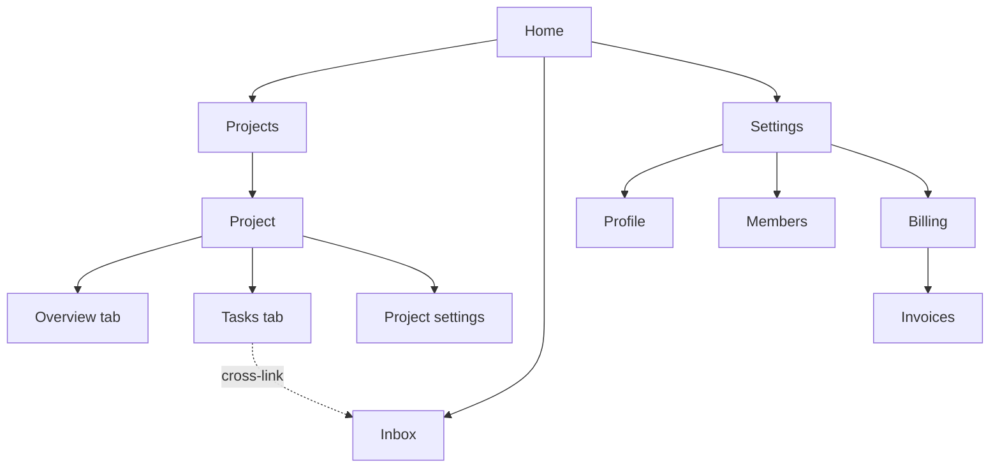
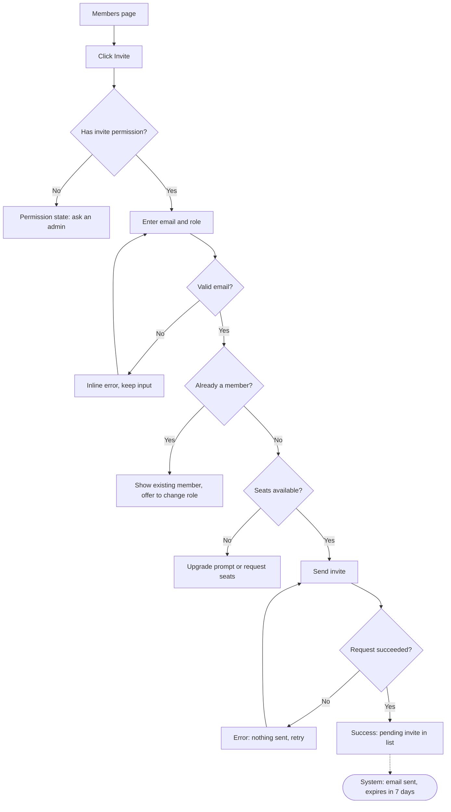

# Information architecture: {Product or area}

**Owner:** {name} · **Brief:** {link to NNN brief} · **Updated:** {date}

## Content inventory

| ID | Page / screen / content type | Current location | Owner | Traffic (30d) | Status | Notes |
| --- | --- | --- | --- | --- | --- | --- |
| C1 | {Invoices list} | /billing/invoices | {team} | {n} | Keep | |
| C2 | {Payment methods} | /settings/payment | | | Merge into C1's area | |
| C3 | {Usage report} | — | | — | New | |

## Object map

| Object | Attributes (key) | Relationships | Actions |
| --- | --- | --- | --- |
| {Project} | name, owner, status, due date | has many Tasks; belongs to Workspace | create, rename, archive, share |

## Glossary

| Name (use this) | Do not use | Definition |
| --- | --- | --- |
| {Workspace} | Team, Organization, Org | {The billing and membership boundary} |

## Sitemap

## Navigation

| Layer | Pattern | Items (in order) | Count |
| --- | --- | --- | --- |
| Global | {Sidebar} | {Home, Projects, Inbox, Settings} | {4} |
| Local | {Tabs on Project} | {Overview, Tasks, Settings} | {3} |
| Contextual | {Links in content} | {Task → related Project} | — |
| Utility | {Top-right} | {Search, Help, Account} | {3} |
| Command menu | {⌘K} | {All destinations + top actions} | — |

## Flows

### Flow: {Primary job, e.g. Invite a teammate}

**Entry:** {where people start} · **Outcome:** {what done looks like}

**Edge cases covered:** {permission, validation, duplicate, limits, server error}
**Edge cases n/a:** {offline: web-only admin page, requires connection}

### Flow: {next job}

…

## Test results

| Method | Participants | Date | Key finding | Change made |
| --- | --- | --- | --- | --- |
| Open card sort | {n} | | | |
| Tree test round 1 | {n} | | | |
